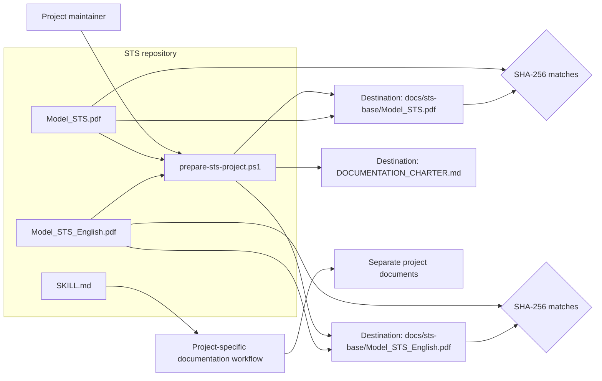
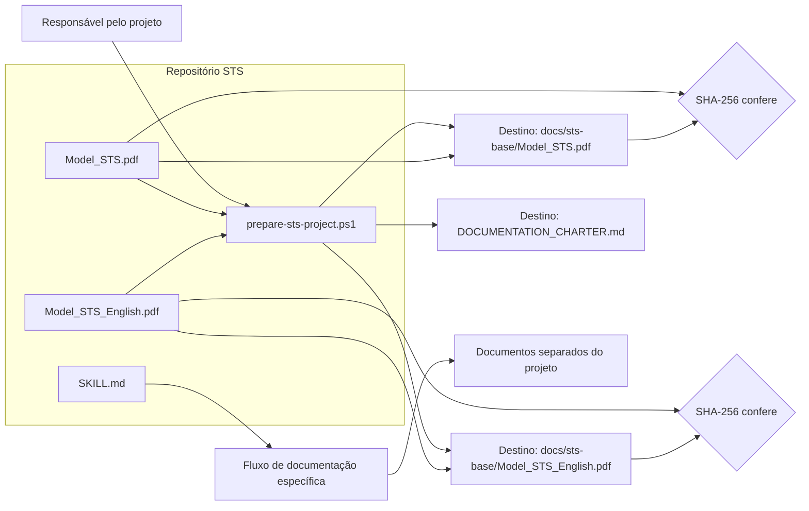

# STS Documentation Generator

**A bilingual documentation toolkit that establishes a verified baseline and guides project-specific software documentation.**

[English](#english) | [Português](#portugues)

[](https://learn.microsoft.com/powershell/)
[](https://daringfireball.net/projects/markdown/)

**Repository:** [github.com/RodrigoTabaldi/STS](https://github.com/RodrigoTabaldi/STS)

<a id="english"></a>
## English

### Overview

STS brings together two Portuguese/English PDF documentation models, an operational skill, and a PowerShell initializer. The script copies the selected model files into another project, creates a documentation charter, and checks each copied PDF against its source with SHA-256. The skill describes how to prepare that baseline and create project-specific documentation.

STS is a practical toolkit, not an official standard, certification, or endorsement. It does not inspect source code or automatically write a complete system specification.

### The problem it addresses

Requirements, architecture decisions, interfaces, tests, and operational evidence can become disconnected as software changes. STS gives a project a consistent documentation structure and guidance for keeping those records traceable.

### Key features

- Portuguese and English baseline PDF models.
- A PowerShell script to initialize the documentation folder in a destination project.
- A generated `DOCUMENTATION_CHARTER.md` that records the selected models and documentation rules.
- SHA-256 comparison of each copied model with its source.
- A skill with separate workflows for preparing the baseline and producing project-specific documentation.
- Guidance for traceability, architecture decision records (ADRs), references, evidence, and avoiding secrets in documentation.
- Model sections cover context, scope, and owners; traceable requirements and acceptance criteria; architecture and ADRs; data and integration contracts; quality, security, and privacy; deployment and operations; references, evidence, and decision history. Keep non-applicable sections with a short rationale.
- Project documents should cite external sources with their title, version, and access date; STS does not replace or republish those sources.

### Screenshots and visual preview

This repository has no application interface or tracked screenshots. Its visual artifacts are the two real PDF models, available here: [Portuguese model](assets/Model_STS.pdf) · [English model](assets/Model_STS_English.pdf).

<!--
No screenshots are currently available. Add real captures to docs/images/ when available:
- docs/images/prepare-sts-project.png — actual PowerShell output after preparing a project.
- docs/images/generated-documentation-tree.png — actual docs/sts-base/ and charter in a destination project.
- docs/images/model-preview.png — a real page from one of the supplied PDF models.
Do not add mockups or generated screenshots.
-->

### Tech stack

| Area | Technologies / current scope |
| --- | --- |
| Backend | Not applicable; this repository has no backend service. |
| Frontend | Not applicable; there is no web or desktop UI. |
| Database | Not applicable; no database or data entities are defined. |
| Infrastructure | Local file system; the script writes to a project directory supplied by the user. No Docker configuration is present. |
| Tools | Windows PowerShell 5.1+, built-in `Get-FileHash` (SHA-256), Markdown, PDF, and Git. |

### Architecture

The script automates baseline setup. The skill provides the human-guided workflow for creating project-specific documents; it is not executed by the script.



### Simplified repository structure

```text
.
├── assets/
│   ├── Model_STS.pdf
│   └── Model_STS_English.pdf
├── docs/
│   └── images/                 # Reserved for real screenshots; none are included yet
├── scripts/
│   └── prepare-sts-project.ps1
├── SKILL.md
├── README.md
└── README.en.md
```

When run, the script creates `docs/sts-base/` and `DOCUMENTATION_CHARTER.md` in the destination project.

### Use as a skill

Expose `SKILL.md` through the skill mechanism supported by the compatible tool. Keep `SKILL.md`, `assets/`, and `scripts/` together because the skill and setup script rely on this repository layout.

### Technical decisions

- **Preserve the canonical PDFs:** keep the supplied models unchanged; approved model updates should retain previous versions for traceability.
- **Verify copies with SHA-256:** confirms that each copied model has the same bytes as its source.
- **Generate a charter with the selected language and model paths:** records which baseline applies and the rules to follow.
- **Separate setup from project documentation:** the script handles repeatable file setup; the skill guides the project-specific work.

### Engineering highlights

- PowerShell automation with a required destination and a constrained `pt` / `en` / `both` language option.
- File operations and post-copy integrity verification using SHA-256.
- Bilingual technical documentation and explicit baseline versioning/preservation guidance.
- Documentation practices for requirements traceability, ADRs, integration contracts, and operational evidence.
- Secret-exclusion guidance for project documentation.

These are documentation and tooling capabilities; this repository does not implement application authentication, authorization, API security, or production infrastructure.

### API endpoints

Not applicable. There is no API. The script's command-line parameters are its user-facing interface.

### Database and entities

Not applicable. The repository has no database schema or application entities.

### Prerequisites

- Windows PowerShell 5.1 or later, running on Windows.
- Git, if cloning the repository.
- Write access to the destination project directory.
- PowerShell must be allowed to run the local script. The example uses `RemoteSigned` for one child process and does not change the persistent execution policy; organization-managed policy may still block it.
- No package installation or environment variables are required.

### Run locally

From PowerShell:

```powershell
git clone https://github.com/RodrigoTabaldi/STS.git
Set-Location .\STS
powershell.exe -NoProfile -ExecutionPolicy RemoteSigned -File .\scripts\prepare-sts-project.ps1 -Destination "C:\path\to\project" -Language both
```

Replace the destination with the project directory that should receive the documentation baseline.

| `-Language` value | Models copied |
| --- | --- |
| `pt` | Portuguese |
| `en` | English |
| `both` | Both (default) |

The script creates `docs/sts-base/`, copies the selected PDF model(s), writes `DOCUMENTATION_CHARTER.md` at the destination root, and compares source/copy SHA-256 values. Existing files with the same names are overwritten; review the destination before running the command.

### Challenges and learnings

The main design constraint is keeping canonical models unchanged while allowing each project to create its own documentation. The repository addresses this by copying models into a separate destination folder, checking their hashes, and directing project-specific documents to separate files.

### Roadmap

- **Completed:** bilingual PDF models, baseline preparation script, charter generation, and SHA-256 copy verification.
- **Future candidate (not implemented or scheduled):** add automated regression checks for the script's output structure and generated charter.

### Current status

STS is a small, reusable documentation toolkit consisting of two PDF models, one skill, and one PowerShell setup script. No application, API, database, automated test suite, or CI workflow is included in this repository.

### Author

**Rodrigo Tabaldi**

Software Engineering student focused on Backend Development, .NET and Full Stack applications.

<a id="portugues"></a>
## Português

### Visão geral

O STS reúne dois modelos PDF de documentação em português e inglês, uma skill operacional e um script de inicialização em PowerShell. O script copia os modelos selecionados para outro projeto, cria uma carta de documentação e compara cada PDF copiado com o original usando SHA-256. A skill descreve como preparar essa base e produzir a documentação específica do projeto.

O STS é um conjunto prático de ferramentas, não um padrão oficial, certificação ou endosso. Ele não inspeciona o código-fonte nem gera automaticamente uma especificação completa do sistema.

### Problema que resolve

Requisitos, decisões de arquitetura, interfaces, testes e evidências operacionais podem perder conexão durante a evolução do software. O STS oferece uma estrutura consistente e orientações para manter esses registros rastreáveis.

### Funcionalidades principais

- Modelos-base em PDF em português e inglês.
- Script PowerShell para inicializar a pasta de documentação em um projeto de destino.
- Geração de `DOCUMENTATION_CHARTER.md` com os modelos selecionados e as regras de documentação.
- Comparação SHA-256 de cada modelo copiado com seu arquivo de origem.
- Skill com fluxos separados para preparar a base e elaborar documentação específica do projeto.
- Orientações sobre rastreabilidade, registros de decisão arquitetural (ADRs), referências, evidências e exclusão de segredos da documentação.
- Os modelos cobrem contexto, escopo e responsáveis; requisitos rastreáveis e critérios de aceite; arquitetura e ADRs; dados e contratos de integração; qualidade, segurança e privacidade; implantação e operação; referências, evidências e histórico de decisões. Mantenha as seções não aplicáveis com uma justificativa breve.
- Documentos do projeto devem citar fontes externas com título, versão e data de consulta; o STS não substitui nem republica essas fontes.

### Screenshots e prévia visual

Este repositório não possui interface de aplicação nem capturas de tela incluídas. Seus artefatos visuais são os dois modelos PDF reais: [modelo em português](assets/Model_STS.pdf) · [modelo em inglês](assets/Model_STS_English.pdf).

<!--
Não há screenshots disponíveis no momento. Adicione capturas reais em docs/images/ quando existirem:
- docs/images/prepare-sts-project.png — saída real do PowerShell após preparar um projeto.
- docs/images/generated-documentation-tree.png — docs/sts-base/ e a carta reais no projeto de destino.
- docs/images/model-preview.png — página real de um dos modelos PDF fornecidos.
Não adicione mockups ou screenshots gerados.
-->

### Tecnologias

| Área | Tecnologias / escopo atual |
| --- | --- |
| Backend | Não se aplica; este repositório não possui serviço de backend. |
| Frontend | Não se aplica; não há interface web ou desktop. |
| Banco de dados | Não se aplica; não há banco ou entidades de dados definidos. |
| Infraestrutura | Sistema de arquivos local; o script grava no diretório de projeto informado. Não há configuração Docker. |
| Ferramentas | Windows PowerShell 5.1+, `Get-FileHash` integrado (SHA-256), Markdown, PDF e Git. |

### Arquitetura

O script automatiza a preparação da base. A skill orienta o fluxo manual para criar documentos específicos do projeto; o script não a executa.



### Estrutura simplificada

```text
.
├── assets/
│   ├── Model_STS.pdf
│   └── Model_STS_English.pdf
├── docs/
│   └── images/                 # Reservada para screenshots reais; vazia no momento
├── scripts/
│   └── prepare-sts-project.ps1
├── SKILL.md
├── README.md
└── README.en.md
```

Ao ser executado, o script cria `docs/sts-base/` e `DOCUMENTATION_CHARTER.md` no projeto de destino.

### Uso como skill

Disponibilize `SKILL.md` pelo mecanismo de skills aceito pela ferramenta compatível. Mantenha `SKILL.md`, `assets/` e `scripts/` juntos, pois a skill e o script de preparação dependem dessa estrutura.

### Decisões técnicas

- **Preservar os PDFs canônicos:** mantenha os modelos fornecidos inalterados; atualizações aprovadas devem preservar as versões anteriores para rastreabilidade.
- **Verificar as cópias com SHA-256:** confirma que cada modelo copiado tem os mesmos bytes do original.
- **Gerar a carta com o idioma e os caminhos selecionados:** registra qual base se aplica e quais regras devem ser seguidas.
- **Separar preparação e documentação do projeto:** o script cuida da preparação repetível dos arquivos; a skill orienta o trabalho específico de cada projeto.

### Destaques de engenharia

- Automação em PowerShell com destino obrigatório e opção de idioma restrita a `pt`, `en` ou `both`.
- Cópia de arquivos e verificação posterior de integridade com SHA-256.
- Documentação técnica bilíngue e orientações explícitas para preservar os modelos-base.
- Práticas documentais de rastreabilidade de requisitos, ADRs, contratos de integração e evidências operacionais.
- Orientações para não incluir segredos na documentação.

Essas capacidades pertencem à documentação e às ferramentas do repositório; ele não implementa autenticação, autorização, segurança de API ou infraestrutura de produção de uma aplicação.

### Endpoints da API

Não se aplica. O projeto não possui API. Os parâmetros do script são sua interface de linha de comando.

### Banco de dados e entidades

Não se aplica. O repositório não contém esquema de banco nem entidades de aplicação.

### Pré-requisitos

- Windows PowerShell 5.1 ou posterior, executado no Windows.
- Git, caso vá clonar o repositório.
- Permissão de escrita no diretório de destino.
- A política do PowerShell deve permitir a execução do script local. O exemplo usa `RemoteSigned` somente em um processo filho e não altera a política persistente; políticas administradas pela organização ainda podem bloqueá-lo.
- Não é necessário instalar pacotes nem configurar variáveis de ambiente.

### Executar localmente

No PowerShell:

```powershell
git clone https://github.com/RodrigoTabaldi/STS.git
Set-Location .\STS
powershell.exe -NoProfile -ExecutionPolicy RemoteSigned -File .\scripts\prepare-sts-project.ps1 -Destination "C:\caminho\para\o\projeto" -Language both
```

Troque o destino pelo diretório do projeto que receberá a base documental.

| Valor de `-Language` | Modelos copiados |
| --- | --- |
| `pt` | Português |
| `en` | Inglês |
| `both` | Ambos (padrão) |

O script cria `docs/sts-base/`, copia os modelos PDF selecionados, grava `DOCUMENTATION_CHARTER.md` na raiz do destino e compara os hashes SHA-256 da origem e da cópia. Arquivos existentes com o mesmo nome são sobrescritos; confira o destino antes de executar.

### Desafios e aprendizados

O principal cuidado de projeto é manter os modelos canônicos inalterados e, ao mesmo tempo, permitir que cada projeto crie sua própria documentação. O repositório trata isso copiando os modelos para uma pasta separada no destino, verificando seus hashes e orientando a criação de documentos específicos em arquivos distintos.

### Roadmap

- **Concluído:** modelos PDF bilíngues, script de preparação da base, geração da carta e verificação das cópias por SHA-256.
- **Possível etapa futura (não implementada nem agendada):** adicionar verificações automatizadas da estrutura gerada pelo script e do conteúdo da carta.

### Status atual

O STS é um conjunto reutilizável de ferramentas documentais composto por dois modelos PDF, uma skill e um script de preparação em PowerShell. Este repositório não inclui aplicação, API, banco de dados, suíte de testes automatizados ou fluxo de CI.

### Autor

**Rodrigo Tabaldi**

Estudante de Engenharia de Software com foco em desenvolvimento Backend, .NET e aplicações Full Stack.
